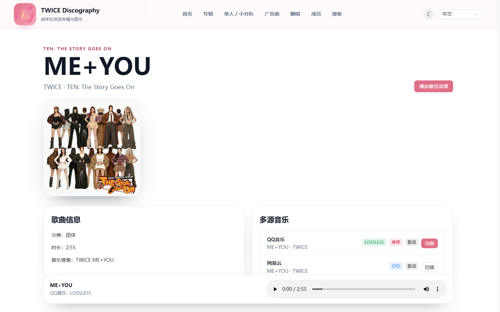

# TWICE Discography

TWICE 完整曲目库网站，整理团体、Solo、小分队、MISAMO、CF、翻唱、Pre-debut 作品，并提供多语言资料页、成员页、搜索、时间线和多源音乐播放。

当前仓库已经落地 Fastify + SQLite 后端曲库 API、MusicSquare 多源音乐接口和 Vue 3 + Naive UI 前端。首页参考 TWICE JYP 官方页，默认使用 `ME+YOU` 合照背景，MV 通过按钮跳转观看，避免嵌入视频出现登录提示。

## 一键部署

[](https://vercel.com/new/clone?repository-url=https%3A%2F%2Fgithub.com%2Ft479842598%2Ftwice-discography&project-name=twice-discography&repository-name=twice-discography&install-command=pnpm%20install&build-command=pnpm%20build%3Afrontend&output-directory=frontend%2Fdist)
[](https://deploy.workers.cloudflare.com/?url=https%3A%2F%2Fgithub.com%2Ft479842598%2Ftwice-discography)
[](https://github.com/t479842598/twice-discography/actions/workflows/pages.yml)

## 功能概览

- 全曲目资料：团体、Solo、Unit、MISAMO、CF、翻唱、Pre-debut。
- 多语言：中文、英文、日文、韩文，支持后端地区提示和前端手动切换。
- 多源音乐：QQ 音乐、网易云、酷我、JOOX，默认选择最高音质，同音质优先 QQ 音乐。
- 歌曲详情：展示多个音乐源、音质、是否可播放、是否推荐、歌词状态。
- 全局播放器：支持手动换源、失败自动换源和切页不断播。
- 秒开优化：首屏曲目、歌曲详情和悬停曲目会提前解析播放地址并预热音频元数据。
- 部署目标：Node/Fastify 后端、静态前端、Vercel、Cloudflare Pages、GitHub Pages。

## 页面截图

| 页面 | 截图 |
|------|------|
| 首页 / ME+YOU 首屏 |  |
| 专辑列表 |  |
| 专辑详情 |  |
| 歌曲详情 / 多源播放 |  |
| Solo / 小分队 / MISAMO |  |
| 成员九宫格 |  |
| 成员详情 |  |
| 广告曲 |  |
| 翻唱 / Pre-debut |  |
| 全局搜索 |  |
| 全局播放器 |  |

## 技术栈

- Monorepo：pnpm workspace
- 后端：Fastify、TypeScript、SQLite、geoip-lite
- 音乐接口：MusicSquare 使用的 QQ / 网易云 / 酷我 / JOOX 接口
- 测试：Vitest、Fastify inject
- 前端：Vue 3、Vite、Naive UI、Vue Router、Pinia、全局播放器

## 快速开始

```bash
pnpm install
pnpm seed
pnpm --filter backend test
pnpm dev
```

后端默认地址：

```text
http://localhost:3000
```

常用接口：

```http
GET /health
GET /api/meta/region-hint
GET /api/catalog/overview
GET /api/albums
GET /api/search?q=FANCY
GET /api/music/search?q=TWICE%20FANCY
GET /api/tracks/:id/music-candidates
GET /api/tracks/:id/playback?source=qq
```

## 环境变量

复制 `.env.example` 为 `.env`，按需修改：

```bash
cp .env.example .env
```

关键配置：

| 变量 | 说明 |
|------|------|
| `BACKEND_PORT` | 后端端口，默认 `3000` |
| `DATABASE_PATH` | SQLite 数据库路径 |
| `CORS_ORIGIN` | 允许访问后端的前端域名 |
| `JOOX_TOKEN` | JOOX 接口 token；为空时自动禁用 JOOX |
| `VITE_API_BASE` | 前端 API 地址 |

## 音乐源规则

展示顺序固定为：

```text
QQ音乐 > 网易云 > 酷我 > JOOX
```

默认播放选择：

1. 过滤不可播放、无音频 URL、链接探测失败的候选。
2. 按音质排序：`LOSSLESS/FLAC > 320K > HQ > STD > LOW`。
3. 同音质时按来源排序：`QQ音乐 > 网易云 > 酷我 > JOOX`。
4. QQ 音乐始终作为推荐源显示；如果其它源音质明显更高，则默认播放更高音质源。

## 部署方法

### 1. Node 服务器部署

适合需要完整后端 API、多源音乐解析和 SQLite 的部署。

```bash
pnpm install --frozen-lockfile
pnpm --filter backend build
pnpm --filter backend start
```

建议生产环境配置：

```env
NODE_ENV=production
BACKEND_PORT=3000
BACKEND_HOST=0.0.0.0
DATABASE_PATH=./data/twice.db
CORS_ORIGIN=https://your-domain.com
JOOX_TOKEN=
```

### 2. Vercel

适合前端静态站点；如果要使用完整音乐 API，需要另外接入 Vercel Functions 或单独部署后端服务。

控制台配置：

| 项目 | 值 |
|------|----|
| Framework Preset | Vite |
| Install Command | `pnpm install` |
| Build Command | `pnpm build:frontend` |
| Output Directory | `frontend/dist` |
| Node Version | `20.x` |

按钮部署：

[](https://vercel.com/new/clone?repository-url=https%3A%2F%2Fgithub.com%2Ft479842598%2Ftwice-discography&project-name=twice-discography&repository-name=twice-discography&install-command=pnpm%20install&build-command=pnpm%20build%3Afrontend&output-directory=frontend%2Fdist)

### 3. Cloudflare Pages

适合静态资料站。Cloudflare Pages 不直接运行当前 Fastify/SQLite 后端，音乐 API 需要改为 Workers/D1 或调用独立后端。

控制台配置：

| 项目 | 值 |
|------|----|
| Framework Preset | Vite |
| Build Command | `pnpm build:frontend` |
| Build Output Directory | `frontend/dist` |
| Root Directory | `/` |
| Node Version | `20` |

按钮部署：

[](https://deploy.workers.cloudflare.com/?url=https%3A%2F%2Fgithub.com%2Ft479842598%2Ftwice-discography)

### 4. GitHub Pages

适合静态资料站，不包含后端 API。仓库已提供 GitHub Pages workflow 入口；第一次运行会自动尝试启用 Pages，前端完成后可直接从 Actions 触发部署。

按钮部署：

[](https://github.com/t479842598/twice-discography/actions/workflows/pages.yml)

手动启用：

1. 打开 GitHub 仓库 `Settings -> Pages`。
2. Source 选择 `GitHub Actions`。
3. 运行 `Deploy GitHub Pages` workflow。

## 测试

```bash
pnpm verify-data
pnpm build
pnpm test
pnpm export-static
```

单独后端验证：

```bash
pnpm --filter backend test
pnpm --filter backend build
```

当前已覆盖：

- 曲库 overview、专辑详情、站内搜索。
- QQ lossless 存在时默认选 QQ。
- QQ 音质较低时选择更高音质来源。
- 同音质时 QQ 优先于网易云。
- QQ 失败时回退到网易云。
- 歌曲候选接口和播放接口返回可用数据。

## License

MIT
