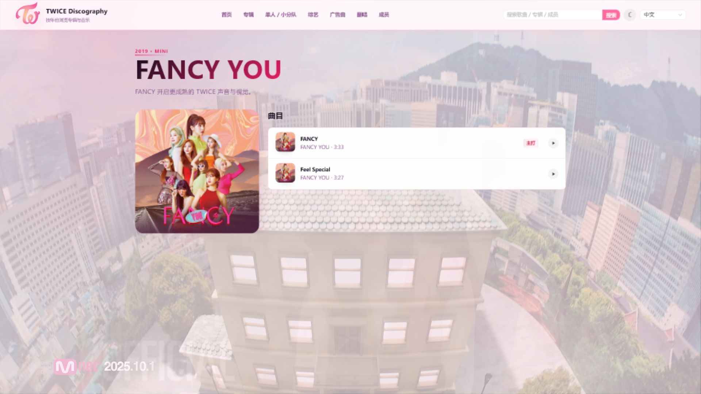
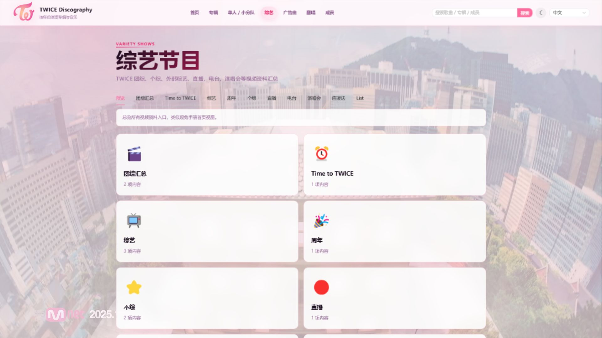
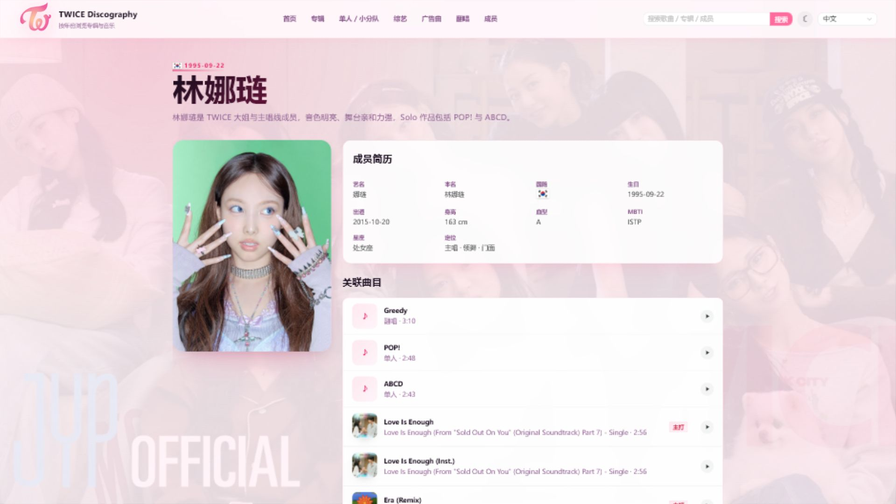

# TWICE Discography

> TWICE 音乐作品资料站：专辑、歌曲、MV、Solo / 小分队、MISAMO、广告曲、翻唱、成员资料与多源音乐播放。

最后更新：2026-05-31  
当前构建验证：`pnpm build` 通过

## 项目简介

`twice-discography` 是一个前后端一体的 TWICE 曲库网站。前端使用 Vue 3 + Vite + Naive UI，后端使用 Fastify + SQLite，生产环境中后端会同时提供 API 与 `frontend/dist` 静态页面。

适合两种部署方式：

- **前后端一体部署**：构建后只启动一个 Node.js 服务，访问同一个域名即可使用页面与 `/api`。
- **前后端分离部署**：前端放到 Vercel / Netlify / Cloudflare Pages，后端放到 VPS / Render / Railway / Fly.io 等 Node 平台。

## 页面截图

截图统一放在 `docs/screenshots/`。桌面截图按 `1920 × 1080` 视口截取，移动端播放器按 `780 × 1688` 高清移动视口截取。


| 页面 | 路由 | 截图 |
| --- | --- | --- |
| 首页 | `/` |  |
| 年份时间线 | `/years/2025` |  |
| 专辑列表 | `/albums` |  |
| 专辑详情 | `/albums/fancy-you` |  |
| 歌曲详情 | `/tracks/fancy` |  |
| Solo / 小分队 | `/solo-unit` |  |
| 综艺节目 | `/variety` |  |
| 广告曲 | `/cfs` |  |
| 翻唱 / Pre-debut | `/covers` |  |
| 成员列表 | `/members` |  |
| 成员详情 | `/members/nayeon` |  |
| 全局播放器 | 任意歌曲播放后 |  |
| 移动端播放器 | `780 × 1688` 高清移动视口 |  |

建议补拍规则：

- 桌面宽度优先使用 `1920 × 1080` 视口，保存网站整屏截图。
- 截图文件统一使用小写短横线命名，例如 `year-2025.png`、`variety.png`。
- 若页面依赖线上封面或视频背景，等待首屏加载完成后再截图。

## 功能特性

- **曲库浏览**：按年份、专辑、歌曲分类查看 TWICE 团体与个人作品。
- **成员资料**：9 位成员资料、国籍旗帜、个人简介、参与曲目。
- **作品分类**：支持 Solo、小分队、MISAMO、广告曲、翻唱、Pre-debut 资料。
- **多语言字段**：中文、英文、日文、韩文标题与说明。
- **顶部搜索直达**：在导航栏搜索专辑、歌曲、成员、广告合作和翻唱，并自动跳转到最佳匹配结果。
- **多源播放**：QQ 音乐、网易云音乐、酷我、JOOX 候选音源与歌词展示。
- **响应式界面**：桌面端与移动端布局适配，支持暗色主题。
- **生产一体服务**：`pnpm build` 后由 Fastify 同时服务 API 与前端静态文件。

## 技术栈

| 层级 | 技术 |
| --- | --- |
| 前端 | Vue 3、Vue Router 4、Pinia、Naive UI、Vite 5、TypeScript |
| 后端 | Fastify 4、TypeScript、better-sqlite3、Zod、geoip-lite |
| 数据库 | SQLite，本地文件默认 `./data/twice.db` |
| 测试 | Vitest、Supertest、vue-tsc |
| 包管理 | pnpm workspace，推荐 `pnpm@9.7.0` |
| 运行环境 | Node.js `>=20` |

## 项目结构

```text
twice-discography/
├─ backend/                 # Fastify API、SQLite 初始化、测试
│  ├─ src/
│  │  ├─ db/                # schema、seed、数据库连接
│  │  ├─ routes/            # catalog / meta / music / tracks
│  │  ├─ services/          # 音乐源选择与缓存
│  │  └─ server.ts          # 服务入口
│  └─ tests/
├─ frontend/                # Vue 3 + Vite 前端
│  ├─ public/               # 静态图片、成员头像、可选视频
│  └─ src/
│     ├─ api/               # API client
│     ├─ components/
│     ├─ router/
│     ├─ stores/
│     └─ views/
├─ data/                    # 默认 SQLite 数据库输出目录
├─ docs/screenshots/        # README 页面截图
├─ scripts/                 # 数据验证、静态导出等脚本
├─ .env.example             # 环境变量模板
├─ package.json             # workspace 脚本
└─ pnpm-workspace.yaml
```

## 快速开始

### 1. 环境要求

- Node.js `20.x` 或更高版本
- pnpm `9.x`，推荐与仓库声明一致的 `9.7.0`
- Git

### 2. 安装依赖

```bash
corepack enable
corepack prepare pnpm@9.7.0 --activate
pnpm install
```

### 3. 配置环境变量

```bash
cp .env.example .env
```

Windows PowerShell：

```powershell
Copy-Item .env.example .env
```

开发环境推荐：

```env
NODE_ENV=development
BACKEND_PORT=3000
BACKEND_HOST=0.0.0.0
DATABASE_PATH=./data/twice.db
CORS_ORIGIN=http://localhost:5173
STATIC_PREFIX=/static
VITE_API_BASE=http://localhost:3000/api
VITE_STATIC_BASE=http://localhost:3000/static
VITE_PLAYER_BASE=/player
VITE_HOME_BG_VIDEO=/media/me-you-bg.mp4
VITE_SITE_BG_VIDEO=/media/me-you-bg.mp4
```

### 4. 初始化数据库

```bash
pnpm seed
```

### 5. 启动开发服务

```bash
pnpm dev
```

默认访问地址：

- 前端开发服务：`http://localhost:5173`
- 后端 API：`http://localhost:3000`
- 健康检查：`http://localhost:3000/health`

## 常用命令

| 命令 | 说明 |
| --- | --- |
| `pnpm dev` | 同时启动前端与后端开发服务 |
| `pnpm dev:frontend` | 只启动 Vite 前端 |
| `pnpm dev:backend` | 只启动 Fastify 后端并初始化数据库 |
| `pnpm build` | 构建前端与后端 |
| `pnpm start` | 生产模式启动后端，并托管 `frontend/dist` |
| `pnpm seed` | 重新初始化 SQLite 数据库 |
| `pnpm test` | 运行所有测试 |
| `pnpm lint` | 运行类型检查 / lint 脚本 |
| `pnpm verify-data` | 验证曲库数据完整性 |
| `pnpm export-static` | 导出实验性静态文件 |

## 环境变量

| 变量 | 作用 | 建议值 |
| --- | --- | --- |
| `NODE_ENV` | 运行环境 | `development` / `production` |
| `BACKEND_PORT` | 后端监听端口 | 本地 `3000`；Render 常用 `10000` |
| `BACKEND_HOST` | 后端监听地址 | 生产环境 `0.0.0.0` |
| `DATABASE_PATH` | SQLite 文件路径 | 本地 `./data/twice.db`；云端建议挂载持久卷 |
| `CORS_ORIGIN` | 允许访问 API 的前端域名 | 一体部署可设为站点域名；开发为 `http://localhost:5173` |
| `STATIC_PREFIX` | 后端静态资源前缀 | `/static` |
| `JOOX_TOKEN` | JOOX 音源 token | 可留空，留空时禁用 JOOX |
| `VITE_API_BASE` | 前端请求 API 的基础地址 | 一体部署 `/api`；分离部署 `https://api.example.com/api` |
| `VITE_STATIC_BASE` | 前端静态资源基础地址 | 一体部署 `/static` |
| `VITE_PLAYER_BASE` | 播放器路径前缀 | `/player` |
| `VITE_HOME_BG_VIDEO` | 首页视频背景 | `/media/me-you-bg.mp4` 或 CDN URL |
| `VITE_SITE_BG_VIDEO` | 全站视频背景 | 可复用 `VITE_HOME_BG_VIDEO` |

注意：

- `VITE_*` 变量会在前端构建时写入产物，修改后必须重新执行 `pnpm build`。
- 云平台若只提供 `PORT` 变量，而本项目读取 `BACKEND_PORT`，需要在平台环境变量中把 `BACKEND_PORT` 设置为平台要求的端口。
- SQLite 文件必须放在持久化目录中，否则云平台重启或重新部署后数据可能丢失。

## API 接口

后端默认地址：`http://localhost:3000`

| 接口 | 说明 |
| --- | --- |
| `GET /health` | 健康检查 |
| `GET /api/meta/region-hint` | 根据 IP 返回地区和建议语言 |
| `GET /api/catalog/overview` | 曲库概览、年份、精选专辑和曲目 |
| `GET /api/albums` | 专辑列表 |
| `GET /api/albums/:id` | 专辑详情 |
| `GET /api/tracks` | 歌曲列表，支持 `category`、`year`、`q` |
| `GET /api/tracks/:id` | 歌曲详情 |
| `GET /api/members` | 成员列表 |
| `GET /api/members/:id` | 成员详情 |
| `GET /api/cfs` | 广告曲列表 |
| `GET /api/covers` | 翻唱列表 |
| `GET /api/search?q=` | 内容搜索 API，供顶部搜索直达使用 |
| `GET /api/music/search?q=` | 音乐源搜索 |
| `GET /api/tracks/:id/music-candidates` | 歌曲音源候选 |
| `GET /api/tracks/:id/playback?source=` | 获取播放链接与歌词 |

示例：

```bash
curl http://localhost:3000/health
curl http://localhost:3000/api/search?q=FANCY
curl http://localhost:3000/api/tracks/fancy/music-candidates
```

## 本地生产构建

一体化生产模式的流程：

```bash
pnpm install --frozen-lockfile
cp .env.example .env
pnpm build
pnpm start
```

访问 `http://localhost:3000`。生产启动时会执行：

1. `node dist/db/init.js`：初始化 SQLite 数据库。
2. `node dist/server.js`：启动 Fastify。
3. 如果存在 `frontend/dist`，后端会托管前端静态文件，并对非 `/api` 路由回退到 `index.html`。

## 部署方法

### 推荐方案 A：Linux VPS 一体部署

适用场景：希望最稳定、最好排查、SQLite 文件可控。推荐用于正式站点。

#### 1. 安装系统依赖

Ubuntu / Debian：

```bash
sudo apt update
sudo apt upgrade -y
sudo apt install -y git curl nginx
curl -fsSL https://deb.nodesource.com/setup_20.x | sudo -E bash -
sudo apt install -y nodejs
sudo corepack enable
corepack prepare pnpm@9.7.0 --activate
```

验证：

```bash
node --version
pnpm --version
nginx -v
```

#### 2. 拉取代码

```bash
cd /var/www
sudo git clone https://github.com/t479842598/twice-discography.git
sudo chown -R $USER:$USER /var/www/twice-discography
cd /var/www/twice-discography
```

#### 3. 配置生产环境

```bash
cp .env.example .env
nano .env
```

示例：

```env
NODE_ENV=production
BACKEND_PORT=3000
BACKEND_HOST=127.0.0.1
DATABASE_PATH=/var/www/twice-discography/data/twice.db
CORS_ORIGIN=https://your-domain.com
STATIC_PREFIX=/static
VITE_API_BASE=/api
VITE_STATIC_BASE=/static
VITE_HOME_BG_VIDEO=/media/me-you-bg.mp4
VITE_SITE_BG_VIDEO=/media/me-you-bg.mp4
```

说明：

- 如果用 Nginx 反向代理到本机，`BACKEND_HOST` 可设为 `127.0.0.1`。
- 如果需要直接暴露 Node 端口，设为 `0.0.0.0`，但更推荐只开放 Nginx 的 `80/443`。

#### 4. 构建并启动

```bash
pnpm install --frozen-lockfile
pnpm build
pnpm start
```

确认健康检查：

```bash
curl http://127.0.0.1:3000/health
```

#### 4.1 一键启动 / 关闭脚本（推荐）

仓库内提供了 Linux 服务器脚本，可在 Ubuntu / Debian / CentOS 等常见发行版上直接运行：

```bash
# 首次运行：自动安装依赖、构建前后端、后台启动服务
chmod +x start-linux.sh stop-linux.sh scripts/linux/*.sh
./start-linux.sh

# 指定端口和监听地址
./start-linux.sh --port 3000 --host 0.0.0.0

# 已安装并构建过时，可跳过安装/构建，加快重启
./start-linux.sh --skip-install --skip-build

# 关闭服务
./stop-linux.sh

# 如果使用了自定义端口，关闭时也传同一个端口
./stop-linux.sh --port 3001
```

脚本说明：

- 首次运行会自动创建 `.env`、执行 `pnpm install --frozen-lockfile` 和 `pnpm build`。
- 后台进程 PID 与日志保存在 `.codex-run/`，该目录不会提交到 Git。
- 默认访问地址为 `http://服务器IP:3000`，本机可用 `http://127.0.0.1:3000`。
- 生产环境建议配合 Nginx / Caddy 做域名、HTTPS 和反向代理。

#### 5. 使用 PM2 后台运行

```bash
sudo npm install -g pm2
pm2 start pnpm --name twice-discography -- start
pm2 status
pm2 logs twice-discography
pm2 save
pm2 startup
```

PM2 常用命令：

```bash
pm2 restart twice-discography
pm2 stop twice-discography
pm2 delete twice-discography
pm2 monit
```

#### 6. 配置 Nginx

创建配置：

```bash
sudo nano /etc/nginx/sites-available/twice-discography
```

写入：

```nginx
server {
    listen 80;
    server_name your-domain.com;

    access_log /var/log/nginx/twice-discography-access.log;
    error_log /var/log/nginx/twice-discography-error.log;

    location / {
        proxy_pass http://127.0.0.1:3000;
        proxy_http_version 1.1;
        proxy_set_header Host $host;
        proxy_set_header X-Real-IP $remote_addr;
        proxy_set_header X-Forwarded-For $proxy_add_x_forwarded_for;
        proxy_set_header X-Forwarded-Proto $scheme;
    }

    location ~* \.(jpg|jpeg|png|webp|gif|ico|css|js|svg|woff|woff2|ttf|eot|mp4|webm)$ {
        proxy_pass http://127.0.0.1:3000;
        expires 30d;
        add_header Cache-Control "public, immutable";
    }
}
```

启用：

```bash
sudo ln -s /etc/nginx/sites-available/twice-discography /etc/nginx/sites-enabled/
sudo nginx -t
sudo systemctl restart nginx
sudo systemctl enable nginx
```

#### 7. 配置 HTTPS

```bash
sudo apt install -y certbot python3-certbot-nginx
sudo certbot --nginx -d your-domain.com
sudo certbot renew --dry-run
```

证书申请完成后，把 `.env` 中的 `CORS_ORIGIN` 改为 HTTPS 域名：

```env
CORS_ORIGIN=https://your-domain.com
```

重启：

```bash
pm2 restart twice-discography
```

#### 8. 更新部署

```bash
cd /var/www/twice-discography
git pull
pnpm install --frozen-lockfile
pnpm build
pm2 restart twice-discography
```

#### 9. 备份数据库

```bash
mkdir -p ~/backups
cp /var/www/twice-discography/data/twice.db ~/backups/twice-$(date +%Y%m%d-%H%M%S).db
```

建议加入定时任务：

```bash
crontab -e
```

```cron
0 2 * * * cp /var/www/twice-discography/data/twice.db /home/ubuntu/backups/twice-$(date +\%Y\%m\%d).db
```

### 推荐方案 B：Windows 服务器一体部署

适用场景：已有 Windows Server 或只想快速在 Windows 环境跑起来。

#### 1. 安装依赖

- 安装 Node.js 20 LTS
- 安装 Git
- 使用 PowerShell 执行：

```powershell
corepack enable
corepack prepare pnpm@9.7.0 --activate
node --version
pnpm --version
```

#### 2. 拉取并构建

```powershell
git clone https://github.com/t479842598/twice-discography.git
cd twice-discography
Copy-Item .env.example .env
pnpm install --frozen-lockfile
pnpm build
pnpm start
```

#### 2.1 一键启动 / 关闭脚本（推荐）

仓库内提供了 Windows 服务器脚本：

```powershell
# 首次启动：自动安装依赖、构建前后端、后台启动服务
.\start-windows.cmd

# 指定端口启动
.\start-windows.cmd -Port 3000 -HostAddress 0.0.0.0

# 已经安装并构建过时，可跳过安装/构建，加快重启
.\start-windows.cmd -SkipInstall -SkipBuild

# 关闭服务
.\stop-windows.cmd
```

脚本说明：

- 首次运行会自动创建 `.env`、执行 `pnpm install --frozen-lockfile` 和 `pnpm build`。
- 后台进程 PID 与日志保存在 `.codex-run/`，该目录不会提交到 Git。
- 默认访问地址为 `http://服务器IP:3000`，本机可用 `http://127.0.0.1:3000`。
- 如果要换端口，启动和关闭都可以加 `-Port`，例如 `.\stop-windows.cmd -Port 3001`。

生产 `.env` 示例：

```env
NODE_ENV=production
BACKEND_PORT=3000
BACKEND_HOST=0.0.0.0
DATABASE_PATH=./data/twice.db
CORS_ORIGIN=http://localhost:3000
VITE_API_BASE=/api
VITE_STATIC_BASE=/static
```

#### 3. 后台运行

```powershell
npm install -g pm2
pm2 start pnpm --name twice-discography -- start
pm2 save
pm2 status
```

#### 4. 开放防火墙

```powershell
New-NetFirewallRule -DisplayName "TWICE Discography" -Direction Inbound -LocalPort 3000 -Protocol TCP -Action Allow
```

如果需要域名和 HTTPS，建议在 Windows 上使用 IIS + URL Rewrite + ARR，或 Nginx for Windows 反向代理到 `http://127.0.0.1:3000`。

### 推荐方案 C：前后端分离部署

适用场景：前端希望使用全球 CDN，后端单独运行 Node API。

部署顺序：

1. 先部署后端，拿到公开 API 域名，例如 `https://twice-api.example.com`。
2. 设置后端环境变量：

```env
NODE_ENV=production
BACKEND_HOST=0.0.0.0
BACKEND_PORT=平台要求端口
DATABASE_PATH=持久卷路径/twice.db
CORS_ORIGIN=https://twice.example.com
```

3. 部署前端时设置：

```env
VITE_API_BASE=https://twice-api.example.com/api
VITE_STATIC_BASE=https://twice-api.example.com/static
```

4. 前端重新构建并发布 `frontend/dist`。

前端平台常用配置：

| 平台 | Root / Base | Build Command | Output / Publish |
| --- | --- | --- | --- |
| Vercel | 仓库根目录 | `pnpm --filter frontend build` | `frontend/dist` |
| Netlify | 仓库根目录 | `pnpm --filter frontend build` | `frontend/dist` |
| Cloudflare Pages | 仓库根目录 | `pnpm --filter frontend build` | `frontend/dist` |

如果平台选择 `frontend` 作为 Root Directory，则命令可改为：

```bash
pnpm build
```

发布目录改为：

```text
dist
```

SPA 刷新 404 处理：

- Vercel 通常能识别 Vite SPA；如遇刷新 404，添加 rewrite 到 `index.html`。
- Netlify 需要 `_redirects` 或 `netlify.toml` 把 `/*` 重写到 `/index.html`。
- Cloudflare Pages 需要确认构建目录和 Vue Router history fallback 配置。

## 线上部署平台选择

| 平台 | 适合部署 | 是否推荐 | 备注 |
| --- | --- | --- | --- |
| VPS / 云服务器 | 前后端一体 | 强烈推荐 | SQLite 文件最可控，Nginx + PM2 最稳定 |
| 宝塔面板 | 前后端一体 | 推荐 | 本质是 Linux + Node 项目 + Nginx 反代，适合图形化管理 |
| Render Web Service | 前后端一体后端 | 推荐 | 需要绑定 `0.0.0.0`，默认端口常用 `10000`，SQLite 要挂 Persistent Disk |
| Railway | 前后端一体后端 | 推荐 | 需要配置 Volume 保存 SQLite；注意平台端口变量与 `BACKEND_PORT` |
| Fly.io | 前后端一体后端 | 推荐 | 适合 Node + SQLite + Volume；需要 `fly.toml` 和挂载卷 |
| Koyeb | 后端或一体服务 | 可选 | Node 服务简单，SQLite 需确认持久卷能力 |
| DigitalOcean App Platform | 后端或一体服务 | 可选 | 易上手，但 SQLite 持久化要额外确认 |
| Vercel | 前端静态站 | 推荐 | 只放前端；后端需另部署 |
| Netlify | 前端静态站 | 推荐 | 只放前端；注意 SPA rewrite |
| Cloudflare Pages | 前端静态站 | 推荐 | CDN 强，适合静态前端；后端另部署 |
| GitHub Pages | 前端静态站 | 谨慎 | Vue history 路由刷新易 404；更适合文档或纯静态页面 |
| Heroku | 后端 Node | 谨慎 | 文件系统是临时的，不适合直接保存 SQLite；更适合改用 Postgres |

最省心组合：

- **正式部署**：VPS + Nginx + PM2 + SQLite 文件备份。
- **低维护分离部署**：Cloudflare Pages / Vercel / Netlify 托管前端，Render / Railway / Fly.io 托管后端。
- **已有域名且想快速上线**：Render 一体服务或 Railway 一体服务，等访问量上来再迁移 VPS。

## 云平台一体部署示例

### Render

Render Web Service 配置：

```text
Runtime: Node
Build Command: pnpm install --frozen-lockfile && pnpm build
Start Command: pnpm start
Health Check Path: /health
```

环境变量：

```env
NODE_ENV=production
NODE_VERSION=20
BACKEND_HOST=0.0.0.0
BACKEND_PORT=10000
DATABASE_PATH=/opt/render/project/src/data/twice.db
CORS_ORIGIN=https://你的服务名.onrender.com
VITE_API_BASE=/api
VITE_STATIC_BASE=/static
```

如果需要 SQLite 持久化，在 Render 添加 Persistent Disk，挂载到：

```text
/opt/render/project/src/data
```

### Railway

Railway 配置：

```text
Build Command: pnpm install --frozen-lockfile && pnpm build
Start Command: pnpm start
```

环境变量：

```env
NODE_ENV=production
BACKEND_HOST=0.0.0.0
BACKEND_PORT=平台分配端口
DATABASE_PATH=/data/twice.db
CORS_ORIGIN=https://你的域名
VITE_API_BASE=/api
VITE_STATIC_BASE=/static
```

Volume：

```text
Mount Path: /data
```

如果 Railway 只注入 `PORT`，需要在平台变量中把 `BACKEND_PORT` 设置成相同端口，或调整代码读取 `process.env.PORT`。

### Fly.io

基础流程：

```bash
fly launch --no-deploy
fly volumes create twice_data --size 1 --region nrt
```

`fly.toml` 需要包含：

```toml
[http_service]
  internal_port = 3000
  force_https = true

[[mounts]]
  source = "twice_data"
  destination = "/data"
```

环境变量：

```bash
fly secrets set NODE_ENV=production
fly secrets set BACKEND_HOST=0.0.0.0
fly secrets set BACKEND_PORT=3000
fly secrets set DATABASE_PATH=/data/twice.db
fly secrets set VITE_API_BASE=/api
fly secrets set VITE_STATIC_BASE=/static
```

部署：

```bash
fly deploy
```

## 首页视频背景

默认配置会尝试加载：

```text
/media/me-you-bg.mp4
```

当前仓库没有提交该视频文件，页面会使用远程图片作为视觉兜底。若要启用本地视频背景：

1. 将有授权的视频放到 `frontend/public/media/me-you-bg.mp4`。
2. 保持 `.env`：

```env
VITE_HOME_BG_VIDEO=/media/me-you-bg.mp4
VITE_SITE_BG_VIDEO=/media/me-you-bg.mp4
```

3. 重新构建：

```bash
pnpm build
```

如果视频较大，建议上传到 CDN，然后配置：

```env
VITE_HOME_BG_VIDEO=https://cdn.example.com/twice/me-you-bg.mp4
VITE_SITE_BG_VIDEO=https://cdn.example.com/twice/me-you-bg.mp4
```

## 测试与验证

完整验证：

```bash
pnpm build
pnpm test
pnpm verify-data
```

单独验证后端：

```bash
pnpm --filter backend test
pnpm --filter backend build
```

单独验证前端：

```bash
pnpm --filter frontend lint
pnpm --filter frontend build
```

上线前手动检查：

- 打开首页、专辑、歌曲详情、成员、搜索页面。
- 检查 `/health` 返回 `{ "ok": true }`。
- 检查 `/api/catalog/overview` 返回曲库数据。
- 刷新深层路由，例如 `/albums/fancy-you`，确认不是 404。
- 检查 SQLite 文件是否写入持久化目录。
- 检查浏览器控制台没有 API CORS 错误。

## 故障排查

### 端口被占用

Linux：

```bash
sudo lsof -i :3000
sudo kill -9 <PID>
```

Windows：

```powershell
netstat -ano | findstr :3000
taskkill /PID <PID> /F
```

### 依赖安装失败

```bash
pnpm store prune
rm -rf node_modules frontend/node_modules backend/node_modules
pnpm install
```

Windows：

```powershell
pnpm store prune
Remove-Item -Recurse -Force node_modules, frontend\node_modules, backend\node_modules
pnpm install
```

### 构建失败

```bash
rm -rf frontend/dist backend/dist
pnpm build
```

Windows：

```powershell
Remove-Item -Recurse -Force frontend\dist, backend\dist
pnpm build
```

### 页面能打开但 API 报错

检查：

- `VITE_API_BASE` 是否指向正确后端。
- `CORS_ORIGIN` 是否包含前端域名。
- 生产环境修改 `VITE_*` 后是否重新构建。
- 后端日志是否有数据库初始化失败。

### 数据库丢失或为空

```bash
pnpm seed
```

云平台上确认：

- `DATABASE_PATH` 指向持久卷。
- 持久卷挂载目录真实存在。
- 服务启动用户对目录有读写权限。

### 音乐无法播放

可能原因：

- 第三方音源接口暂时不可用。
- 当前歌曲在某个音源没有可播放链接。
- JOOX 未配置 `JOOX_TOKEN`。
- 浏览器或网络拦截了跨域媒体资源。

处理方式：

- 切换候选音源。
- 检查 `/api/tracks/:id/music-candidates`。
- 查看后端日志中的音乐源错误。

## 数据与版权说明

© 2026 [t479842598](https://github.com/t479842598). All rights reserved.

本项目用于学习、资料整理与技术演示。音乐、图片、视频、商标与艺人相关内容版权归对应权利方所有。部署公开站点时，请确保所使用的媒体素材、封面、视频背景、歌词与播放源符合当地法律和平台规则。

## 参考链接

- [Vite 静态部署指南](https://vite.dev/guide/static-deploy.html)
- [Vercel Vite 文档](https://vercel.com/docs/frameworks/frontend/vite)
- [Netlify Vite 文档](https://docs.netlify.com/build/frameworks/framework-setup-guides/vite/)
- [Cloudflare Pages 构建配置](https://developers.cloudflare.com/pages/configuration/build-configuration/)
- [Render Web Services](https://render.com/docs/web-services/)
- [Render Persistent Disks](https://render.com/docs/disks)
- [Railway Volumes](https://docs.railway.com/develop/volumes)
- [Fly.io Volumes](https://fly.io/docs/js/the-basics/volumes/)

## License

MIT
